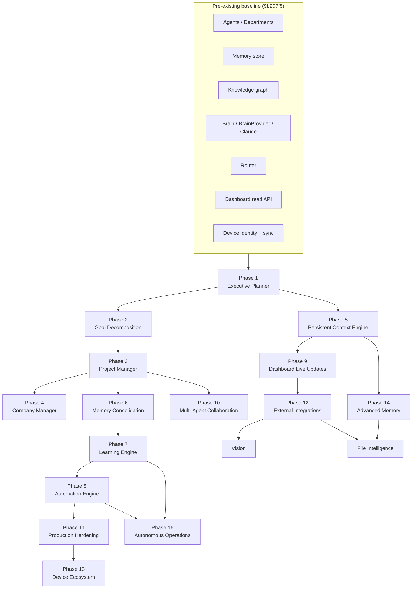
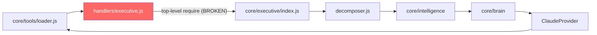
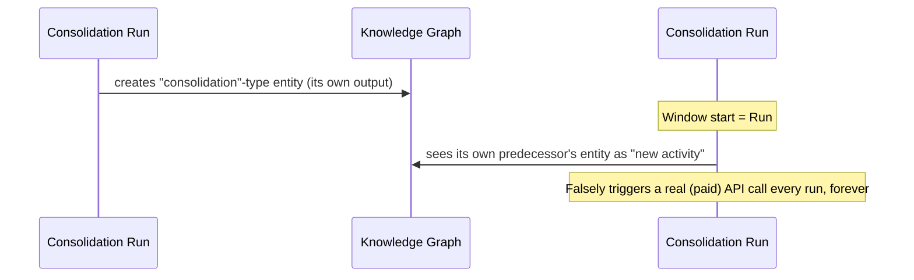
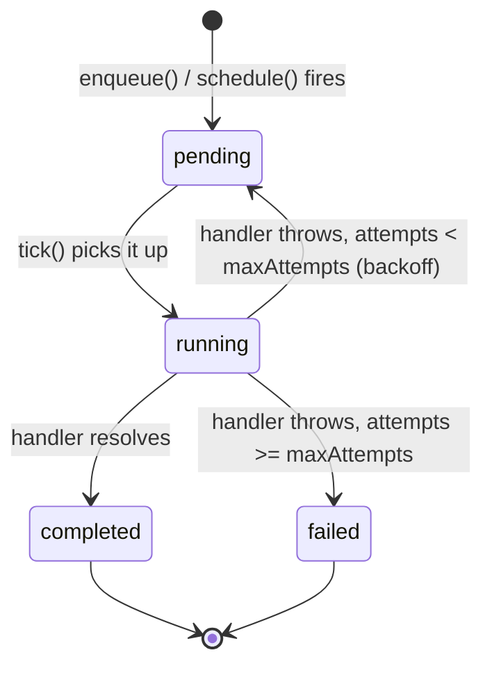
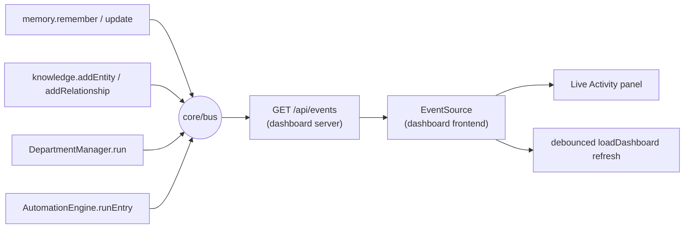
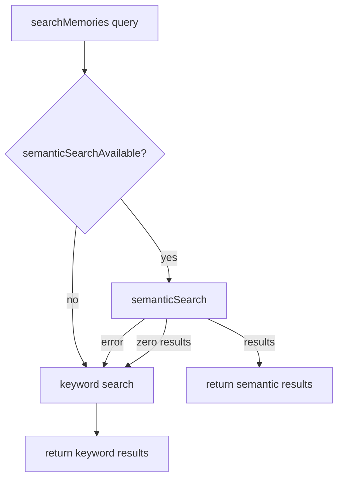
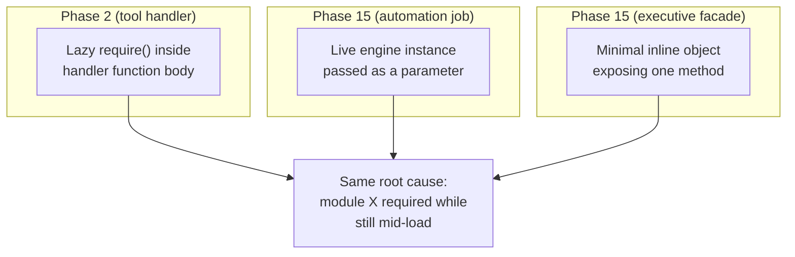

# VERONICA — Intelligence Layer Engineering Audit

**Scope:** every phase built in the "Intelligence Layer" milestone, from
the `9b207f5` baseline commit ("Initial VERONICA architecture baseline")
through `029f2dd` ("Continuing beyond Phase 15: File Intelligence").
**Date:** 2026-07-22.
**Companion documents:** `docs/Architecture.md` (the full structural
decision log this audit summarizes — read that for *why*, this document
for *what/how to verify*), `docs/SYSTEM_AUDIT.md` (the pre-milestone
baseline audit), `docs/FINAL_SYSTEM_STATE.md` (current whole-system
snapshot).

## Methodology

File lists below come directly from `git show --stat` on each phase's
commit, not from memory. Test counts come from `grep -c '^test(' <file>`
against the actual test files and from live `npm test` runs. Every
"Tests passing" figure is the cumulative total *at the end of that
phase*, as reported to the user in this same session; the final row of
this document confirms the current full-repo total. "Commands to
demonstrate" are commands that were actually run against the live system
during this work (terminal commands, `curl` against a running dashboard
server, or direct `node -e` calls), not hypothetical examples.

---

## Phase-by-phase build order



---

## Phase 1 — Executive Planner

**Objective:** convert a goal into a scheduled, department-assigned,
prioritized project.

**Files created**
- `core/executive/planner.js` — `ExecutivePlanner` class
- `core/executive/index.js` — facade
- `tests/executive.test.js`

**Files modified**
- `core/memory/store.js` — additive `metadata` field on every entry
- `docs/Architecture.md` — decision log entry

**Tests added:** 12 (`tests/executive.test.js`)
**Tests passing at end of phase:** 80 / 80

**Commands to demonstrate**
```
# Terminal
executive.plan {"title":"Launch new product line","priority":4,"deadline":"2026-08-01"}
executive.roadmap
executive.deadlines

# Tool (agent-facing)
tools.run executive.plan {"title":"Q3 audit","department":"hades"}

# Dashboard
curl -s http://127.0.0.1:4000/api/executive/roadmap
curl -X POST http://127.0.0.1:4000/api/executive/plan \
  -H "Authorization: Bearer $API_TOKEN" -H "Content-Type: application/json" \
  -d '{"title":"New goal"}'
```

**Remaining limitations**
- Department assignment and effort/priority scoring are rule-based
  (keyword match + heuristics), not LLM reasoning — deliberate, for
  determinism and testability without mocking a brain on every call.
- No mutable status yet (that's Phase 3).
- Dependencies are validated against the roadmap at plan time; no cycle
  detection beyond direct duplicates.

---

## Phase 2 — Goal Decomposition Engine

**Objective:** break a planned project into milestones and tasks via real
LLM reasoning.

**Files created**
- `core/executive/decomposer.js` — `GoalDecomposer` class
- `tests/executive-decomposer.test.js`

**Files modified**
- `core/executive/index.js` — wired `decompose()`
- `core/tools/handlers/executive.js` (new file, first appearance) —
  lazy-required tool handlers

**Tests added:** 4
**Tests passing at end of phase:** 84 / 84

**Commands to demonstrate**
```
executive.decompose <projectId>
tools.run executive.decompose {"projectId":"<id>"}
curl -X POST http://127.0.0.1:4000/api/executive/projects/<id>/decompose \
  -H "Authorization: Bearer $API_TOKEN"
```

**Remaining limitations**
- No recursive decomposition (a task can't be decomposed further).
- No re-decomposition/update of an already-decomposed project.
- Subtasks/deliverables are structured data on their task, not
  independently-scheduled entities (see Architecture.md rationale).

**Diagram — the circular-require bug found and fixed here** (the first
occurrence of a pattern that recurred in Phases 7, 8, 9, and 15):


Fixed by moving the `require("../../executive")` call inside each handler
function body (executed at call time, after module loading has finished)
instead of at module top level.

---

## Phase 3 — Project Manager

**Objective:** mutable status/progress/timeline/artifacts on top of
Phase 1's projects.

**Files created**
- `core/executive/projectManager.js` — `ProjectManager` class
- `tests/executive-project-manager.test.js`

**Files modified**
- `core/memory/store.js` — new `update(id, changes)` function (the
  first mutate-in-place operation the memory system had)
- `core/memory/index.js` — exposed `update()`
- `core/executive/index.js` — wired `getProject`/`updateStatus`/
  `addArtifact`

**Tests added:** 10
**Tests passing at end of phase:** 94 / 94

**Commands to demonstrate**
```
executive.status <id> in_progress "kicked off"
executive.artifact <projectId> "https://github.com/org/repo/pull/1"
executive.project <projectId>

curl -X POST http://127.0.0.1:4000/api/executive/projects/<id>/status \
  -H "Authorization: Bearer $API_TOKEN" -H "Content-Type: application/json" \
  -d '{"status":"in_progress","note":"underway"}'
```

**Remaining limitations**
- `progress()` is derived from decomposed task completion, falling back
  to a coarse status-based estimate if nothing's been decomposed yet —
  not a granular percentage without decomposition.
- Milestone/task-level dashboard views don't exist (only project-level
  detail is surfaced); only the raw JSON dump via "Project detail."

---

## Phase 4 — Company Manager

**Objective:** a container above projects — companies with employees,
documents, finances, relationships, communications.

**Files created**
- `core/executive/companyManager.js` — `CompanyManager` class
- `tests/executive-company-manager.test.js`

**Files modified**
- `core/executive/planner.js` — optional `goal.company` tagging;
  `roadmap({ company })` filter
- `core/executive/index.js` — wired all company methods
- `dashboard/frontend/index.html` / `app.js` — "Companies" panel

**Tests added:** 11
**Tests passing at end of phase:** 105 / 105

**Commands to demonstrate**
```
company.create {"name":"Acme Rockets","industry":"aerospace","departments":["hephaestus"]}
company.employee <companyId> "Jane Doe"
company.finance <companyId> {"label":"Client invoice","amount":1000,"type":"revenue"}
company.get <companyId>

curl -X POST http://127.0.0.1:4000/api/companies \
  -H "Authorization: Bearer $API_TOKEN" -H "Content-Type: application/json" \
  -d '{"name":"Acme Rockets"}'
```

**Remaining limitations**
- Finances are a minimal ledger (label/amount/type/timestamp), not an
  accounting system — no currencies, categories, or reconciliation.
- Relationships (clients/partners/vendors) live only in the knowledge
  graph, not a queryable company-scoped list.
- No employee accounts/auth — employees are records, not logins.

---

## Phase 5 — Persistent Context Engine

**Objective:** automatic context injection (memory, knowledge, goals,
department roster, device identity) into every reasoning call.

**Files created:** none (extended existing files)

**Files modified**
- `core/context/engine.js` — full rewrite of `retrieve()` to gather 7
  context dimensions instead of just memory+knowledge
- `core/intelligence/index.js` — calls `context.retrieve()` automatically
  on every `think()`
- `core/router/index.js` — removed its own now-redundant context fetch

**Tests added:** 5 (`tests/context-engine.test.js`)
**Tests passing at end of phase:** 110 / 110

**Commands to demonstrate**
```
ask what should I focus on today
# Every department run and `ask` now includes active goals, recent
# project activity, department roster, and device identity in the
# prompt automatically -- verify by inspecting result.thought.cognition.prompt
```

**Remaining limitations**
- Still keyword-based retrieval at this point (semantic search didn't
  exist until Phase 14).
- No caching — `retrieve()` re-reads from disk on every call (fine for a
  personal, single-user system's data volume).
- Company scope (`options.companyId`) is a hook; nothing calls it
  automatically yet.

---

## Phase 6 — Executive Memory Consolidation

**Objective:** nightly-style synthesis of recent activity into summaries/
patterns/recommendations.

**Files created**
- `core/executive/consolidation.js` — `MemoryConsolidation` class
- `tests/executive-consolidation.test.js`

**Files modified**
- `core/executive/index.js` — wired `consolidate()`/`consolidationHistory()`

**Tests added:** 5
**Tests passing at end of phase:** 115 / 115

**Commands to demonstrate**
```
executive.consolidate
executive.consolidations
curl -X POST http://127.0.0.1:4000/api/executive/consolidate -H "Authorization: Bearer $API_TOKEN"
```

**Remaining limitations**
- No scheduler at this point — trigger manually (fixed in Phase 8, which
  this phase explicitly deferred to).
- Skips the LLM call entirely when nothing changed since the last run
  (by design, not a limitation, but means an empty consolidation costs
  nothing and reports "No new activity").

**Diagram — a real bug caught here:**

Fixed by excluding `type: "consolidation"` entities from the
`knowledgeUpdates` bucket in `gather()`.

---

## Phase 7 — Learning Engine

**Objective:** track department/agent/tool execution outcomes and
generate optimization recommendations.

**Files created**
- `core/learning/log.js` — flat JSON-lines execution log
- `core/learning/engine.js` — `LearningEngine` (aggregation + recommend)
- `core/learning/index.js` — facade
- `tests/learning-log.test.js`, `tests/learning-engine.test.js`

**Files modified**
- `core/tools/base.js` — every `Tool.execute()` call now timed and logged
- `core/departments/base.js` — `run()` gained a `try`/`catch` it never
  had before, timed and logged on both branches

**Tests added:** 7 (own files) + regression coverage in
`tests/tools.test.js`/`tests/departments.test.js`
**Tests passing at end of phase:** 123 / 123

**Commands to demonstrate**
```
learning.overview
learning.departments
learning.tools
learning.recommend
curl http://127.0.0.1:4000/api/learning/overview
```

**Remaining limitations**
- `executions.log` grows unbounded — no pruning built (no concrete need
  shown yet for a personal system's log to be large enough to matter).
- No scheduler yet at this point (Phase 8).

**Real gap fixed, not just instrumented:** `DepartmentManager.run()`
never had a `catch` block before this phase — a failed department run
vanished with zero trace anywhere. Tracking failed decisions required
making failures observable at all first.

---

## Phase 8 — Automation Engine

**Objective:** a persisted job queue with retry/backoff and a recurring
scheduler for background jobs.

**Files created**
- `core/automation/engine.js` — `AutomationEngine` (generic, no executive/
  learning/tools dependency)
- `core/automation/jobs.js` — wires the 2 (later 3) built-in jobs
- `core/automation/index.js` — facade
- `core/tools/handlers/automation.js`
- `tests/automation-engine.test.js`

**Files modified**
- `dashboard/backend/server.js` — starts the tick loop on real boot only
  (`require.main === module` guard)
- `.gitignore` — `core/automation/state.json`

**Tests added:** 10
**Tests passing at end of phase:** 133 / 133

**Commands to demonstrate**
```
automation.status
automation.run consolidate
automation.runNow learning-recommend
curl -X POST http://127.0.0.1:4000/api/automation/jobs/consolidate/run \
  -H "Authorization: Bearer $API_TOKEN"
```

**Remaining limitations**
- Fixed intervals only, no cron-expression scheduling.
- Jobs run sequentially, no real concurrency.
- The tick loop only runs while the dashboard server process is up — no
  OS-level daemon/service installation is built (documented, not hidden).

**Diagram — job lifecycle:**


---

## Phase 9 — Dashboard Live Updates

**Objective:** replace 15s polling with real-time push updates.

**Files created:** none (extended existing files)

**Files modified**
- `dashboard/backend/server.js` — new `GET /api/events` SSE endpoint
- `core/memory/index.js` — `remember()`/`update()` publish `memory.updated`
- `core/knowledge/index.js` — `addEntity()`/`addRelationship()` publish
  `knowledge.updated` (create branch only)
- `core/departments/base.js` — publishes `department.activity`
- `core/automation/engine.js` — publishes `automation.jobCompleted`
- `dashboard/frontend/app.js`/`index.html` — `EventSource` + Live Activity
  feed, `setInterval` removed

**Tests added:** 2 new SSE tests in `tests/dashboard.test.js`
**Tests passing at end of phase:** 135 / 135

**Commands to demonstrate**
```
curl -N http://127.0.0.1:4000/api/events
# in another terminal, trigger any action (remember, plan a goal, run a
# department task) and watch the event arrive within milliseconds
```

**Remaining limitations**
- One connection streams every event type — no per-topic subscription.
- No event history/replay for a client that connects after an event
  fired (a fresh tab only sees new events from that point forward).
- `core/device/sync.js`'s `merge()` calls bypass the instrumented
  wrapper, so sync imports don't trigger live-update events.

**Diagram — event flow:**


**Real bug found here:** the SSE dispatch ran *outside* the request
handler's `try`/`catch` — a synchronous throw would be an unhandled
promise rejection at the process level. Fixed by moving it inside (this
became relevant again in Phase 11's audit).

---

## Phase 10 — Multi-Agent Collaboration

**Objective:** agent-to-agent communication, delegation, review, and
consensus voting.

**Files created**
- `core/collaboration/engine.js` — `CollaborationEngine` (caller-
  constructed, like `Router`, not a self-contained singleton)
- `tests/collaboration-engine.test.js`

**Files modified**
- `core/executive/projectManager.js` — `reassignDepartment()` (task
  handoff — a different concept, project-state, not agent-to-agent)
- `core/interface/terminal.js` / `dashboard/backend/server.js` — both
  construct `new CollaborationEngine(departments)` alongside their
  existing `departments` array

**Tests added:** 9 (7 + 2 for `reassignDepartment`)
**Tests passing at end of phase:** 144 / 144

**Commands to demonstrate**
```
collaborate.message hades hephaestus "budget update"
collaborate.delegate hades hephaestus "build the widget"
collaborate.review hades "draft proposal text"
collaborate.consensus hades,hephaestus,apollo "Ship the new feature"
executive.handoff <projectId> hephaestus "moving to engineering"
```

**Remaining limitations**
- Every operation is human/dashboard/terminal-triggered — no
  agent-initiated collaboration (an agent deciding mid-reasoning to
  delegate) — that would require wiring into the tool-use loop itself.
- No delegation/review chains deeper than one hop.
- Every vote counts equally in consensus — no weighting by department
  expertise.

**Diagram — class relationships:**
```mermaid
classDiagram
    class CollaborationEngine {
        +departments[]
        +sendMessage()
        +delegate()
        +review()
        +consensus()
        +history()
    }
    class DepartmentManager {
        +id
        +agents[]
        +run(task)
    }
    CollaborationEngine --> DepartmentManager : holds array of
    CollaborationEngine ..> "core/memory" : records
    CollaborationEngine ..> "core/knowledge" : links
    CollaborationEngine ..> "core/bus" : publishes
```

---

## Phase 11 — Production Hardening

**Objective:** an audit-driven security/reliability pass.

**Files created**
- `core/logging/index.js` — leveled logger + durable error log
- `core/logging/crashGuard.js` — process-level crash guards
- `tests/logging.test.js`, `tests/crash-guard.test.js`

**Files modified**
- `dashboard/backend/server.js` — SSE moved inside `try`/`catch`,
  `crypto.timingSafeEqual` token comparison, new `GET /api/health` +
  `GET /api/logs/errors`, crash guards installed on real boot path
- `core/interface/terminal.js` — crash guards installed at module load

**Tests added:** 11 (8 own files) + regression additions
**Tests passing at end of phase:** 155 / 155

**Commands to demonstrate**
```
curl http://127.0.0.1:4000/api/health
curl http://127.0.0.1:4000/api/logs/errors
# timing-safe token check: any wrong-length bearer token is rejected
# without a timing side-channel
curl -X POST http://127.0.0.1:4000/api/memory -H "Authorization: Bearer wrong"
```

**Remaining limitations**
- No rate limiting (personal, single-user, localhost-bound system — no
  concrete need shown).
- No log rotation/pruning for `errors.log`.
- Existing `console.log` boot messages were *not* routed through the new
  logger — deliberate scope discipline, not an oversight (rewriting dozens
  of working call sites for no functional gain).

**Real gaps found by direct audit** (grep for `uncaughtException`/
`unhandledRejection` across the repo, trace of every dashboard response
path): zero process-level crash handling existed anywhere before this
phase, and the Phase 9 SSE endpoint's dispatch running outside the
try/catch was a live, unfixed latent bug until this pass found it.

---

## Phase 12 — External Integrations

**Objective:** Obsidian vault sync and an outbound HTTP connector.

**Files created**
- `core/integrations/obsidian.js` — vault read/write/index
- `core/integrations/http.js` — allowlisted outbound HTTP
- `core/tools/handlers/integrations.js`
- `tests/obsidian-integration.test.js`, `tests/http-integration.test.js`

**Files modified:** `core/tools/loader.js`, `registry/tools.json`

**Tests added:** 11
**Tests passing at end of phase:** 166 / 166

**Commands to demonstrate**
```
tools.run obsidian.list {}
tools.run obsidian.index {}
tools.run web.fetch {"url":"https://example.com"}
# fails closed by default:
SERVICE_ALLOWLIST unset -> {"error":"No external services are allowlisted..."}
```

**Remaining limitations**
- `OBSIDIAN_VAULT_PATH` defaults to the repo root — a real second vault
  needs the env var set explicitly.
- `web.fetch` requires `SERVICE_ALLOWLIST` to be configured per hostname;
  nothing is reachable out of the box.
- No general "filesystem intelligence" beyond the vault at this point —
  deliberately deferred (built later, see "File Intelligence" below).

**Real bug found here:** `http.js`'s `request()` validated input with a
synchronous `throw` before being declared `async` — callers using
`.catch()`/`await` wouldn't catch a bad-input error the same way as a
real network failure. `assert.rejects()` in the new tests caught this
exactly as designed.

---

## Phase 13 — Device Ecosystem

**Objective:** actual multi-device awareness on top of the pre-existing
device identity/sync mechanism.

**Files created**
- `core/device/registry.js` — known-devices roster
- `tests/device-registry.test.js`

**Files modified**
- `core/device/sync.js` — `importState()` now records every sighting
- `.gitignore` — `core/device/known-devices.json`

**Tests added:** 4 (+ 1 assertion added to the existing sync test)
**Tests passing at end of phase:** 170 / 170

**Commands to demonstrate**
```
device.identity
device.known
curl http://127.0.0.1:4000/api/device/known
```

**Remaining limitations**
- Only the *import* side records a sighting — a device pulling an export
  (`GET`) doesn't identify itself today, so no symmetric export-side
  awareness.
- No device trust/pairing model beyond the existing bearer token gating
  all writes.

---

## Phase 14 — Advanced Memory

**Objective:** real embedding-based semantic search, additive to
keyword search.

**Files created**
- `core/memory/embeddings.js` — `EmbeddingIndex` (OpenAI-backed)
- `tests/embeddings.test.js`

**Files modified**
- `core/memory/index.js` — `semanticSearchAvailable()`/
  `reindexEmbeddings()`/`semanticSearch()`
- `core/context/engine.js` — `retrieve()` made `async`; tries semantic
  search first, falls back to keyword on any failure/empty result
- `core/intelligence/index.js` — `await this.context.retrieve(...)`
- `.gitignore` — `core/memory/embeddings.json`

**Tests added:** 5 (own file) + `tests/context-engine.test.js` updated to
`async`/`await` throughout, plus 1 new fallback test
**Tests passing at end of phase:** 176 / 176

**Commands to demonstrate**
```
memory.reindexEmbeddings   # requires OPENAI_API_KEY
memory.semanticSearch "find anything about budgets"
curl http://127.0.0.1:4000/api/memory/semantic-search-status
```

**Remaining limitations**
- Requires `OPENAI_API_KEY` — falls back to keyword search everywhere
  when unset (verified: this repo's `.env` has it unset, so every test
  and every live run in this session exercised the fallback path, not
  real semantic search).
- Not wired into `memory.remember()` — indexing is a separate, explicit,
  batched step (cost-conscious, same posture as consolidation/learning).
- No blended keyword+semantic+importance ranking formula.

**Diagram — retrieval fallback:**


---

## Phase 15 — Autonomous Operations

**Objective:** a self-monitoring loop tying planner + learning + automation
together — detection and recommendation only, no autonomous remediation.

**Files created**
- `core/executive/selfMonitor.js` — `SelfMonitor` class
- `tests/self-monitor.test.js`

**Files modified**
- `core/automation/jobs.js` — registers `self-monitor` as the third
  built-in job, passing the *live engine instance* directly (not a
  `require()`, to avoid re-entering `core/automation/index.js` mid-load)
- `core/executive/index.js` — facade access with a minimal inline object
  standing in for `executive` (same self-reference reason)
- `tests/automation-engine.test.js` — new regression test requiring the
  real facade fresh and confirming all 3 jobs are scheduled

**Tests added:** 6 (5 + 1 regression test)
**Tests passing at end of phase:** 182 / 182

**Commands to demonstrate**
```
executive.selfCheck
executive.selfMonitorHistory
curl -X POST http://127.0.0.1:4000/api/executive/self-check -H "Authorization: Bearer $API_TOKEN"
```

**Remaining limitations**
- No autonomous remediation by design — detects and recommends only,
  per this run's own standing instruction to stop short of destructive/
  consequential automated action.
- Thresholds (30% failure rate, 5-execution floor, 3 repeated failures)
  are fixed constants, not configurable per installation.
- Only 3 signals checked (deadlines, failure rate, automation health) —
  no company financial health or knowledge-graph staleness checks yet.

**Diagram — the third occurrence of the circular-dependency pattern,
solved differently each time:**


---

## Vision (continuing beyond Phase 15)

**Objective:** image understanding via Claude's native multimodal
support — no new dependency, no OCR library.

**Files created**
- `core/vision/engine.js` — `Vision` class
- `core/vision/index.js` — facade
- `core/tools/handlers/vision.js`
- `tests/vision.test.js`

**Files modified**
- `core/brain/providers/claude.js` — new `analyzeImage()` method
  (deliberately not routed through the shared `BrainProvider` fallback
  chain — see limitations)

**Tests added:** 3
**Tests passing at end of phase:** 185 / 185

**Commands to demonstrate**
```
tools.run vision.analyzeImage {"path":"screenshot.png"}
# image must already exist in data/workspace/ (the same sandbox every
# filesystem tool uses)
```

**Remaining limitations**
- Single static images only — no video, no PDF-to-image rendering.
- No dashboard image-upload flow — the image must already be in
  `data/workspace/`.
- Claude-only by design (silently falling back to a non-vision provider
  would return a confidently wrong answer, worse than a clear error).

---

## File Intelligence (continuing beyond Phase 15)

**Objective:** index and grep-search arbitrary text-based files, closing
a deferral made explicitly in Phase 12.

**Files created**
- `core/integrations/fileIntelligence.js`
- `tests/file-intelligence.test.js`

**Files modified:** `core/tools/handlers/integrations.js`,
`registry/tools.json`

**Tests added:** 5
**Tests passing at end of phase:** 190 / 190

**Commands to demonstrate**
```
tools.run files.list {}
tools.run files.search {"query":"TODO"}
tools.run files.index {}
```

**Remaining limitations**
- Grep-based search only, not semantic (would need a second embeddings
  namespace keyed by file path — no concrete need yet to justify it).
- Files over 200KB are skipped during indexing, not truncated.
- Plain text only — no PDF/binary parsing (images are Vision's job).

**Real bug caught before shipping:** the first test draft asserted "at
least 3 files found" based on a miscount of its own fixture (only 2
indexable files existed in the test's temp directory) — failed
immediately, corrected to match the fixture rather than loosened.

---

## Cumulative totals

| Metric | Value |
|---|---|
| Phases/capabilities delivered | 17 (15 numbered + Vision + File Intelligence) |
| Git commits (this milestone, excluding the pre-existing baseline) | 9 |
| Total tests | 190 |
| Tests passing | 190 (100%) |
| Tools registered (`registry/tools.json`) | 47 |
| Services registered (`registry/services.json`) | 11 |
| Real bugs found and fixed by the test suite | 9 (see per-phase notes above; also documented in `docs/Architecture.md`) |
| New top-level `core/` modules | 8 (`executive`, `learning`, `automation`, `collaboration`, `logging`, `integrations`, `vision`, plus `device/registry.js` and `memory/embeddings.js` extending existing modules) |

Verify the whole suite at any time with:
```
npm test
```
