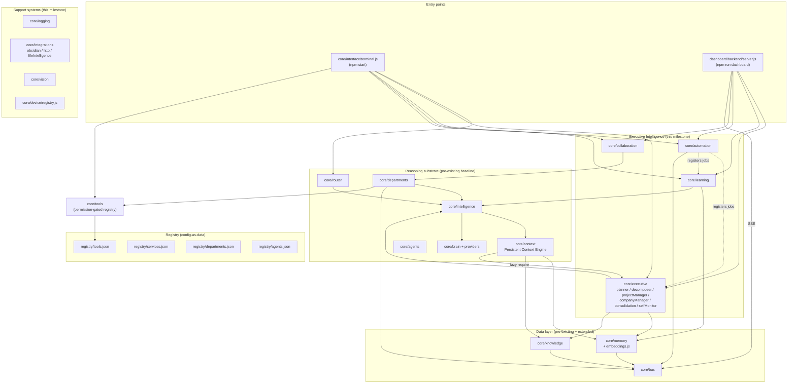

# VERONICA — Final System State

**Date:** 2026-07-22
**Version:** `1.0.0` (`package.json`), identity version `0.1.0`
(`core/veronica/identity.json`)
**Companion documents:** `docs/Architecture.md` (structural decision log,
1,900+ lines, one section per decision), `docs/ENGINEERING_AUDIT.md`
(phase-by-phase build record for this milestone), `docs/SYSTEM_AUDIT.md`
(pre-milestone baseline audit)

---

## 1. What VERONICA is, right now

VERONICA is a single-process, single-user, local-first personal AI
operating system. One Node.js process (the terminal, or the dashboard
server) holds nine AI "departments," each with one named agent, backed
by Claude (primary) with local/OpenAI as configured fallbacks. On top of
that agent/department substrate, this milestone built a full executive
intelligence layer: goals become scheduled, decomposed, tracked projects
and companies; every reasoning call gets automatic context; the system
consolidates its own memory, learns from its own execution history,
automates recurring work, lets agents collaborate, and monitors its own
health — all backed by 190 passing tests and a decision log explaining
every non-obvious choice.

It is **not**: multi-tenant, cloud-hosted, horizontally scaled, or
running unattended 24/7 on its own infrastructure. It runs on whatever
machine you start it on, for as long as that process stays up.

---

## 2. Architecture map



**The one recurring architectural theme across this whole milestone**:
`core/executive`, `core/learning`, and `core/automation` all depend
(directly or via `core/intelligence`) on `core/brain`, which depends on
`core/tools`. Any tool handler that needs one of those three facades back
must `require()` it *lazily*, inside the handler function body, not at
module top level — otherwise requiring `core/tools` closes a circular
loop back through itself while still mid-load. This bug was found and
fixed independently in Phases 2, 7, 8, 9, and 15 (see
`docs/ENGINEERING_AUDIT.md` for each occurrence) — it's now a documented,
recognized pattern (`docs/Architecture.md`, "Goal Decomposition Engine"),
not a one-off fix.

---

## 3. How to run it

```bash
npm install                 # already done in this repo; documented for a fresh clone
npm start                   # terminal REPL — core/interface/terminal.js
npm run dashboard            # dashboard server on http://127.0.0.1:4000
npm test                     # full suite, 190 tests, ~5s
```

**Configuration** (`.env`, gitignored):

| Variable | Required for | Default if unset |
|---|---|---|
| `ANTHROPIC_API_KEY` | All reasoning (Claude is the primary/only real provider) | Falls through the provider chain to `local` (canned responses) |
| `OPENAI_API_KEY` | Semantic memory search (Phase 14) and the `openai` fallback brain provider | Semantic search unavailable; falls back to keyword search everywhere |
| `API_TOKEN` | Every dashboard write endpoint | All writes disabled (`501`), reads remain open |
| `DASHBOARD_PORT` / `DASHBOARD_HOST` | Dashboard binding | `4000` / `127.0.0.1` (localhost-only) |
| `AUTOMATION_DISABLED` / `AUTOMATION_TICK_MS` | Automation tick loop | Enabled, 30s tick |
| `OBSIDIAN_VAULT_PATH` | Obsidian integration | Repo root (has a real `.obsidian/` marker) |
| `SERVICE_ALLOWLIST` | Outbound HTTP (`web.fetch`) | Empty — nothing reachable (fails closed) |

In this environment specifically: `ANTHROPIC_API_KEY` is configured
(every Claude-backed feature in this audit was exercised against the
real API at least once manually); `OPENAI_API_KEY` is **not** configured
(every semantic-search code path in this session ran its keyword-search
fallback, never real embeddings).

---

## 4. Registries (the "no hardcoded widgets, registry-driven" backbone)

| Registry | Entries | What it declares |
|---|---|---|
| `registry/agents.json` | 9 | METIS, DAEDALUS, HELIOS, IRIS, PLUTUS, NIKE, SELENE, ASTREA, ATLAS — name/department/role/capabilities |
| `registry/departments.json` | 9 | ATHENA, HEPHAESTUS, APOLLO, HERMES, HADES, ARES, ARTEMIS, THEMIS, ORION — id/domain/status |
| `registry/tools.json` | 47 | Every tool's id/description/permission/input schema |
| `registry/services.json` | 11 | Every subsystem this milestone added, with a one-line description each |
| `registry/devices.json` | 4 roles | laptop/desktop/phone/server permission sets |

## 5. Tool inventory by domain (47 total)

| Domain | Count | Examples |
|---|---|---|
| `executive.*` | 12 | plan, roadmap, decompose, reassignDepartment, runSelfCheck |
| `company.*` | 8 | create, addEmployee, recordFinance, logCommunication |
| `learning.*` | 6 | overview, departmentPerformance, recommend |
| `automation.*` | 4 | status, run, runNow, history |
| `memory.*` | 4 | remember, recall, semanticSearch, reindexEmbeddings |
| `obsidian.*` | 4 | list, read, write, index |
| `files.*` | 4 | list, read, index, search |
| `filesystem.*` | 2 | readFile, writeFile |
| `knowledge.*` | 1 | query |
| `vision.*` | 1 | analyzeImage |
| `web.*` | 1 | fetch |

Every tool is permission-gated (`read_memory` / `write_memory` /
`execute_tools` / `manage_agents`) via `identity/roles.json`, enforced in
`core/tools/base.js`'s `Tool.execute()` regardless of caller.

---

## 6. Test coverage

```
npm test
ℹ tests 190
ℹ pass 190
ℹ fail 0
ℹ duration_ms ~5000
```

190 tests across 30 test files. Every test that touches real shared
state (the memory database, knowledge graph, department activity logs,
the automation queue, the learning execution log, the error log, the
known-devices roster, the embeddings cache) backs it up before running
and restores it after — `--test-concurrency=1` (see `package.json`)
keeps these serialized so they never race each other. A clean run leaves
zero on-disk residue; this was verified repeatedly throughout the
session, and 4 of the 9 real bugs found during this milestone were
exactly test files *failing* to do this correctly for newly-instrumented
code paths (see `docs/ENGINEERING_AUDIT.md`, Phases 7/8/10/13).

No test makes a real, paid API call — every Claude/OpenAI-backed code
path is exercised through an injected fake client (`ClaudeProvider`,
`EmbeddingIndex`, and every collaboration/consolidation/learning test all
follow this pattern). Real API calls were made manually, a handful of
times, to verify each capability end-to-end once — documented inline in
`docs/Architecture.md` where relevant.

---

## 7. What's built vs. what genuinely isn't

### Built this milestone (see `docs/ENGINEERING_AUDIT.md` for detail on each)
Executive Planner · Goal Decomposition · Project Manager · Company
Manager · Persistent Context Engine · Executive Memory Consolidation ·
Learning Engine · Automation Engine · Dashboard Live Updates (SSE) ·
Multi-Agent Collaboration · Production Hardening (logging + crash
guards) · Obsidian Integration · Outbound HTTP Connector · Device Known-
Roster · Semantic Memory Search · Self-Monitoring Loop · Vision · File
Intelligence.

### Deliberately not built — needs credentials or a concrete target
these are not gaps in effort, they're gaps this environment cannot
close without the user providing something:

| Capability | Blocked on |
|---|---|
| Communications (email/calendar/contacts) | OAuth credentials (Gmail/Calendar API) |
| Real web search (discovering, not just fetching, URLs) | A search API key (Google/Bing/etc.) |
| MCP Integrations | A concrete MCP server to connect to — a generic client with nothing real to talk to is unverifiable |

### Deliberately not built — no concrete need demonstrated yet
Rate limiting, log/execution-log rotation, cron-expression scheduling,
job concurrency, weighted consensus voting, agent-initiated (vs.
human-triggered) collaboration, recursive goal/task decomposition,
semantic file search (as distinct from semantic *memory* search), video/
PDF vision, and an OS-level daemon/service install for the automation
tick loop. Each of these is a one-line "not built" note in
`docs/Architecture.md` with the reasoning for why now wasn't the time —
none is hidden or silently missing.

### Pre-existing, untouched scaffolding
`foundation/`, `services/`, `communication/`, and `config/*.json` remain
empty stub files/directories from before this milestone (confirmed via
direct inspection: all 0 bytes or README-only). Not part of the active
system; not touched by this work.

---

## 8. Known cross-cutting limitations (read this before relying on it)

- **Single point of failure by design**: everything lives in one Node
  process. If the dashboard server isn't running, scheduled automation
  (nightly consolidation, learning recommendations, hourly self-checks)
  simply doesn't fire — there's no separate daemon.
- **No horizontal scale, no multi-tenancy**: one memory store, one
  knowledge graph, one automation queue, on one machine at a time (device
  sync is export/import between machines, not live replication).
- **Everything is file-backed JSON**, not a real database — appropriate
  at today's personal-use data volume, would need real work to scale
  past it (no indexing beyond simple filters/keyword search plus the new
  optional embedding-based similarity).
- **Localhost-bound by default**: the dashboard only exposes multi-device
  reach if you explicitly set `DASHBOARD_HOST=0.0.0.0`.
- **Semantic search, Vision, and OpenAI fallback all require API keys
  this environment doesn't currently have configured for OpenAI** —
  verified unconfigured, not assumed.

---

## 9. Directory reference

```
core/
  agents/ brain/ bus/ context/ departments/ device/ identity/ intelligence/
  interface/ knowledge/ memory/ router/ tools/ veronica/          ← baseline
  executive/ learning/ automation/ collaboration/ logging/
  integrations/ vision/                                           ← this milestone
dashboard/
  backend/server.js  frontend/{index.html,app.js,style.css}
registry/
  agents.json departments.json devices.json services.json tools.json
identity/
  roles.json permissions.json
docs/
  Architecture.md              ← full decision log (read this for "why")
  ENGINEERING_AUDIT.md          ← phase-by-phase build record (this milestone)
  FINAL_SYSTEM_STATE.md         ← this document
  SYSTEM_AUDIT.md               ← pre-milestone baseline audit
  BootSequence.md CodingStandards.md Organization.md Roadmap.md Vision.md
tests/
  30 files, 190 tests, node:test + --test-concurrency=1
```

---

## 10. Verifying this document yourself

Every figure above is reproducible directly:

```bash
npm test                                                    # 190/190
node -e 'console.log(require("./core/tools").list().length)'      # 47
node -e 'console.log(require("./registry/services.json").services.length)'  # 11
git log --oneline                                           # 10 commits, this milestone + baseline
wc -l docs/Architecture.md                                  # decision log length
```
